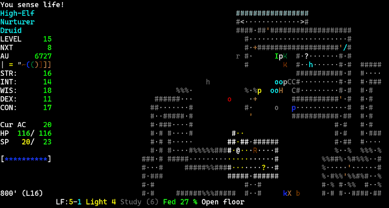

# Tactical Angband

The following is a (possibly incomplete) list of changes made to Tactical
Angband relative to (Vanilla) Angband.

## Scores

Use standard turns in the highscore table.

## Dungeon

Map size has been reduced. Persistent dungeons are now on by default. Monsters
fully heal when you enter a level to prevent stairs being used for easy
healing during fights.

## Escape spells / items

Replaced phase door scrolls/activations with potions of running (temp +1 moves)

There is a new "scroll of locking", that repairs and locks doors adjacent to
the player.

Replaced teleport objects/activations with wand of swap places.

Removed all teleport, teleport other, banishment, mass banishment and
*destruction* objects, including artifact activations.

Amulet of running (+1 moves): dlvl 40 item.

Ego item: boots of running (+1 moves).

## Monster spell/breath damage

Monster breath damage halved, and most damage caps halved.

Monster spell damage halved, except for Morgoth and Sauron.

## Monster summoning

Altered monster summoning: level of summoned monsters can be up to two thirds
of summoner level, and is not dungeon level dependent. Summon group sizes greatly
reduced.

## Status effects

Status effects are always dangerous (even with resist). Now rConf, rBlind, etc have
the following behaviours:

Player: 1 in 6 chance of being effected. Duration reduced to 16%
Monster: 1 in 6 chance of being effected. Duration reduced to 33%

Free action is still 100% effective for the player.

## Class changes

### Mage

* Phase Door, Teleport Self, Teleport Other and Teleport Level have been
  replaced with Running, Locking, Swap Places and Imprisonment respectively.

### Rogue

* Phase Door, Teleport Self, Teleport Other and Teleport Level have been
  replaced with Running, Locking, Swap Places and Imprisonment respectively.
* "Hit and run" now teleports up to 5 squares (not 20).

# Angband 4.2.4

  
  

Angband is a graphical dungeon adventure game that uses textual characters to
represent the walls and floors of a dungeon and the inhabitants therein, in the
vein of games like NetHack and Rogue. If you need help in-game, press `?`.

- **Installing Angband:** See the [Official Website](https://angband.github.io/angband/) or [compile it yourself](https://angband.readthedocs.io/en/latest/hacking/compiling.html).
- **How to Play:** [The Angband Manual](https://angband.readthedocs.io/en/latest/)
- **Getting Help:** [Angband Forums](http://angband.oook.cz/forum/)

Enjoy!

-- The Angband Dev Team
